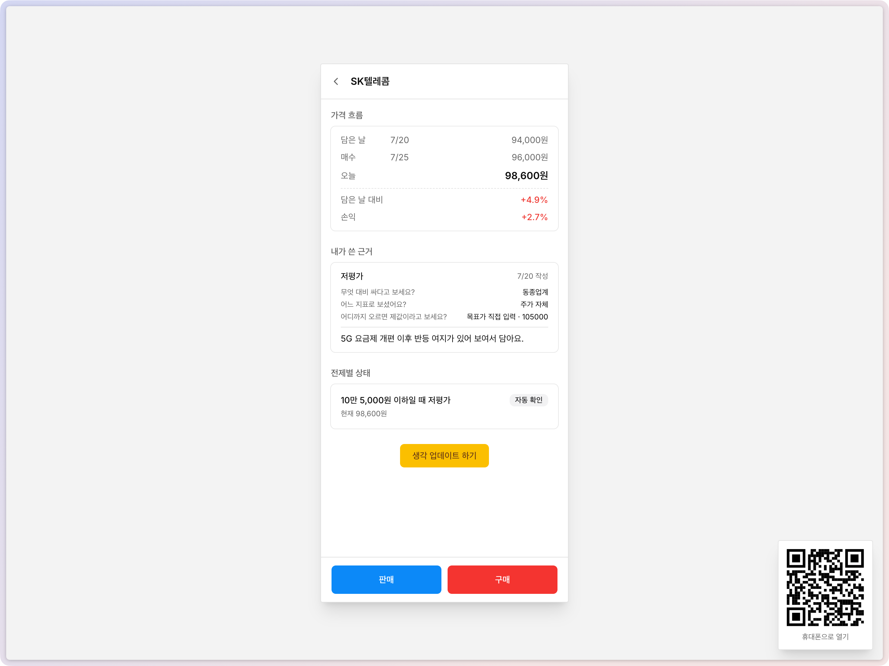

# 사기 전에 - 왜 담았는지 기억하기

관심종목에 종목을 담을 때 "왜 담는지"를 묻고, AI가 그 이유를 함께 짚어봅니다.
나중에 실제로 살 때는 다시 묻지 않고 그때 적어둔 내용을 보여주고,
적어둔 전제가 깨지면 사용자에게 알려줍니다.

[](https://before-buy-stock.vercel.app/)

> 이미지를 누르면 서비스로 이동합니다. 따로 로그인할 필요 없이 체험할 수 있습니다.

주소: https://before-buy-stock.vercel.app/

2026년 8월에 테스트 해 본 개인 프로젝트입니다. 만들면서 내린 판단은 [decisions.md](./decisions.md)에, 코드 관련 결정은 [docs/adr](./docs/adr)에 정리했습니다.

---


## 비즈니스 목표와 지표

**목표**

근거를 적고 담은 종목이, 그렇지 않은 종목보다 손실 구간에서 오래 방치되지 않게 하는 것입니다. 대신 관심종목에서 매수로 넘어가는 비율과 주문 속도는 그대로 유지해야 합니다. 거래를 줄이는 기능이 아니라, 왜 샀는지 설명하지 못하는 보유를 줄이는 기능입니다.

**지표**

새로 만드는 기능이라 아직 기준선이 없습니다. 실제 서비스에 붙인다면 아래 현재값을 먼저 재고, 목표는 그 값을 보고 정할 생각입니다. 목표 칸의 숫자는 가안입니다.

| 지표 | 현재값 | 목표(가안) | 판정 시점 |
|---|---|---|---|
| 관심종목 등록 완료율 | 기존 서비스 값 | 하락하지 않음 (가드레일) | 출시 후 4주 |
| 등록 건 중 근거 작성률 | 0 (기능 없음) | 30% 이상 | 출시 후 4주 |
| 매수 시 근거를 본 뒤 행동이 바뀐 비율 (수량 조정·취소·근거 갱신) | 0 (기능 없음) | 5% 이상. 0에 가까우면 가설 기각 | 출시 후 4주 |
| 근거를 쓴 종목과 안 쓴 종목의 손실 구간 보유 기간 | 안 쓴 종목의 현재값 | 쓴 종목이 더 짧음 | 출시 후 12주 |
| 주문 시작에서 체결까지 걸리는 시간 | 기존 서비스 값 | 늘어나지 않음 (가드레일) | 상시 |

프로토타입 단계에서 측정한 것은 위 지표가 아니라 AI 응답 품질입니다. 응답의 한국어 깨짐률을 41.8%에서 0%로 줄인 과정은 [ADR-0003](./docs/adr/0003-structured-output-over-forced-tool-call.md)에, 모델이 지시를 어겼을 때 재시도할지 경고만 남길지 정한 기준은 [ADR-0013](./docs/adr/0013-warn-instead-of-retry-for-model-rule-violations.md)에 있습니다.


## 중요하게 생각한 판단 세 가지

만들면서 내린 판단 중 제품 방향을 정한 것들입니다. 자세한 내용은 [decisions.md](./decisions.md) 앞부분에 있습니다.

1. **묻는 시점을 매수 직전이 아니라 관심종목에 담을 때로 정했습니다.** 매수 직전에 입력을 받으면 그 사이 가격이 움직이고, 이미 사기로 마음먹은 사람에게 반박을 보여줘도 잘 받아들여지지 않습니다. 담을 때 묻고, 살 때는 적어둔 것을 보여주기만 합니다. ([B-2](./decisions.md#b-2-개입-지점을-매수-직전에서-관심종목-등록으로-이동))
2. **AI 응답을 세어 보고 호출 방식을 바꿨습니다.** 처음 방식(강제 tool-call)에서는 한국어 문장의 41.8%가 깨졌습니다. 출력 방식 3가지와 모델 2가지를 비교해 구조화 출력으로 바꾸니 0%가 됐고, 모델을 올리지 않아도 돼서 비용은 그대로였습니다. ([E-1](./decisions.md#e-1-강제-tool-call을-버리고-구조화-출력으로-58-adr-0003))
3. **규제와 권한 문제를 설계 단계에서 처리했습니다.** 프롬프트에 "종목 평가는 하지 않고 근거 검증만 한다"를 예문으로 넣었고, 매도를 권하는 것처럼 보이는 버튼은 화면에서 뺐고, 시세 조회용 키와 거래용 키를 파일 단위로 분리했습니다. ([A-4](./decisions.md#a-4-규제를-리스크가-아니라-설계-제약으로-다루기), [C-9](./decisions.md#c-9-프롬프트-원칙을-다시-씀--내부-정합성이-핵심-기능을-억제할-뻔함), [B-8](./decisions.md#b-8-규제-원칙을-화면-액션-레벨까지-관철), [C-5](./decisions.md#c-5-한투-api-도메인-분리--조회는-실전-거래는-모의))


## 배경 및 접근방법

매매일지나 투자원칙을 기록하는 앱은 이미 많지만, 대부분 자리를 잡지 못했습니다.
기록이 거래와 분리되어 있기 때문이라고 생각합니다.

거래하는 앱이 아닌 별도 앱에 손으로 옮겨 적는 기록은 정작 매수하는 순간에는 열어보지 않게 됩니다. 그러면 기록이 맞았는지 확인할 수도 없고, 근거로 삼은 전제가 무너져도 알아채기 어렵습니다.

그래서 기록하는 자리를 **관심종목에 담는 순간**으로 옮겼습니다.
아직 살지 말지 정하지 않은 상태라 시간 압박이 없고, 주문 흐름을 건드리지 않습니다. 긴 글을 쓰지 않아도 되도록 질문은 카테고리 선택 방식으로 만들었습니다.

이 기록을 바탕으로 주문하기 전에 한 번 보여주고, 근거로 삼은 기준에 변동이 생기면 서비스에서 알려줍니다.


## 어떻게 동작하나

| | 언제 | 무엇을 |
|---|---|---|
| **1** | 관심종목에 담을 때 | "왜 이 종목이 궁금하세요?"를 묻습니다. 카테고리를 고르고, 이어지는 질문에 답하고, 원하면 한두 줄 의견을 덧붙입니다 |
| **2** | 담기 직전 | AI가 반대 시각과 확인해볼 질문을 보여줍니다. 반박할 만한 점이 없으면 보여주지 않습니다 |
| **3** | 저장할 때 | 적은 내용을 나중에 확인할 수 있는 형태로 나눠 저장합니다. 예) "PER 15배 아래를 유지한다" |
| **4** | 실제로 살 때 | 새로 묻지 않고 그때 적은 내용을 보여줍니다. 적어둔 게 없으면 아무것도 나타나지 않습니다 |
| **5** | 담아둔 동안 · 보유하는 동안 | 저장한 전제가 깨지면 알려줍니다 |


## 스택

- Next.js (App Router) · TypeScript · Tailwind CSS
- shadcn/ui
- Bun
- Neon (Postgres) · Drizzle ORM
- Anthropic API
- 한국투자증권 REST API


## 시작하기

```bash
bun install
cp .env.example .env.local   # 값을 채운 뒤
bun dev
```


## 설계 노트

- **AI는 종목을 추천하지 않습니다.**
"사세요", "좋은 종목입니다" 같은 판단을 하지 않고, 사용자가 적은 이유를 검토한 의견만 줍니다. 판단은 사용자가 합니다.

- **주문 흐름을 방해하지 않습니다.**
매수 버튼과 체결 사이에 입력을 요구하면 그 사이 가격이 바뀔 수 있습니다. 개입은 관심종목을 추가할 때와 매수 직전에 적어둔 내용을 보여주는 것까지이고, 이유를 적지 않은 종목에는 아무것도 하지 않습니다.

- **서비스가 확인할 수 없는 전제는 그렇다고 표시합니다.**
"경쟁사가 진입하지 않는다" 같은 전제는 수치로 판정할 수 없습니다. 이런 항목은 `직접 확인 필요`로 구분해 보여줍니다.


## 주의
- 개인 프로젝트이며 **투자 자문을 목적으로 하지 않습니다.** 모든 정보는 사용자의 기록과 점검을 돕기 위한 것이고, 투자 판단과 책임은 사용자에게 있습니다.
- 시세·재무 조회에 쓰는 API 키는 조회 전용이며, 주문 권한이 없는 경로에서만 사용합니다.
